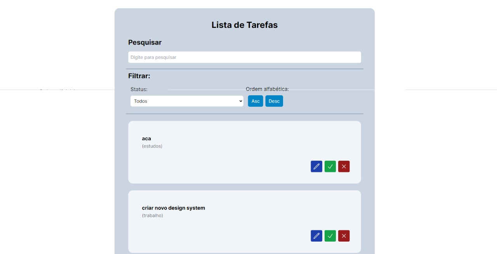

# Lista de Tarefas

> Aplicação de gerenciamento de tarefas (to-do list)

### Funcionalidades

- [x] Adicionar nova tarefa
- [x] Filtrar as tarefas por status (concluídas e não concluídas).
- [x] Filtrar as tarefas por ordem alfabética (ascendente e descendente)
- [x] Pesquisar Tarefas
- [x] Editar Tarefa
- [x] Concluir Tarefa
- [x] Excluir Tarefa

### Tecnologias

- Next.JS
- Tailwind CSS
- Javascript

